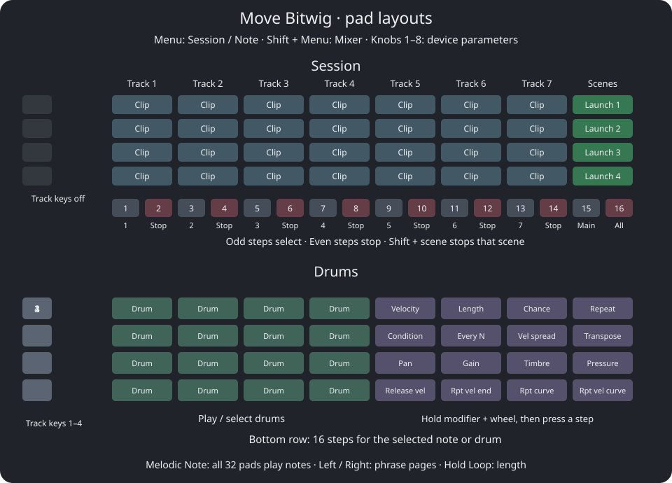

# Move Bitwig controls

**Menu switches Session and Note. Shift + Menu opens Mixer.** Shift keeps your current screen visible and changes only the footer hints. Step buttons are numbered 1–16, left to right.

## Start a song

1. Press **Shift + Step 1** to create an instrument track and open the browser. **Shift + Step 2** creates an audio track and opens Session. To start another phrase on an existing instrument track, arm it (double-press its track key in Note, or Sample), then press an empty Session clip pad. On an unarmed track, an empty clip pad stops that track.
2. Turn the wheel to choose a sound; click to load it. Up/Down jumps eight results. Back cancels.
3. Play a pad, then tap bottom-row steps to place that note. If the selected track has no clip, the first step creates one using **Bitwig's default clip length**.
4. Press Menu for Session and launch the clip. Menu returns to Note for editing.
5. Use the four track keys in Note to change instruments (Shift + track key also launches its clip and shows its device chain). The sequencer follows the selected track's clip; it cannot edit a clip on another track.

To edit a different existing phrase, use **Shift + its Session pad**. The track window follows your selection in Bitwig. Note's four track keys select the first four tracks in that window.

## Note and drums

| Action | Control |
| --- | --- |
| Choose a pitch or drum | Play a pad |
| Add/remove that note | Tap a step |
| Enter a chord | Hold several melodic pads and tap a step |
| Add a different pitch to a held step | Hold the step and press a playable pad |
| Step velocity / length | Hold a step; turn Volume / wheel |
| Fine step length | Hold Shift with the step and wheel |
| Transpose a step / nudge its notes | Hold a step; Up/Down / Left/Right |
| Previous/next phrase page | Left/Right |
| Octave / single scale degree | Up/Down / Shift + Up/Down |
| Drum bank: 16 drums / four drums | Up/Down / Shift + Up/Down |
| Select a drum in Bitwig | Shift + drum pad |
| Drum chain volume | Hold drum pad and turn Volume |
| Mute a drum | Mute + drum pad |
| Mute/unmute the selected note on a step | Mute + step (muted notes light dim) |
| Delete every note of a pitch/drum from the clip | Delete + pad |
| Launch the clip you are editing | Shift + its track key |

Pads light when notes play from Bitwig as well as when you play Move. The drum layout follows the track's instrument even when you select an effect. Drum names come from the rack's chains, such as Kick or Snare.

The step buttons show **only the selected pitch**. The screen shows the selected note and device, and below them the clip as one cell per bar: outlined bars are inside the loop, a baseline marks bars outside it, the playing bar fills up as it plays, and the line underneath marks the bars currently on the step buttons. Navigation stops at the loop boundaries.

### Right-hand drum modifiers

The right 4x4 pads are sixteen **note-expression modifiers**. Each holds one value, shown by its color: dim at the default, brighter the further it is moved, white while held.

| Row (top first) | Pads, left to right |
| --- | --- |
| 1, groove basics | Velocity · Length (in steps) · Chance · Repeat |
| 2, variation | Condition · Every N · Velocity spread · Transpose |
| 3, sound | Pan · Gain · Timbre · Pressure |
| 4, release and repeat shape | Release velocity · Repeat velocity end · Repeat curve · Repeat velocity curve |

| Action | Control |
| --- | --- |
| Change a modifier's value | Hold its pad, turn the wheel (Shift = fine) |
| Apply it to the selected drum's note on a step | Hold the modifier pad, press the step |
| Same, from the step | Hold the step, tap the modifier pad |
| Edit a held step live | Hold the step and the modifier pad, turn the wheel |
| Reset to default | Double-tap the modifier pad |

While a modifier pad is held, the step row shows which of the selected drum's notes carry a non-default value for it, and the screen shows the value as a meter. Values are kept per modifier, not per drum, and do not change live pad playing. Condition cycles Bitwig's occurrence conditions (First, Not first, Fill, ...); Every N plays the note on the first of every N loop cycles.

### Phrase length and pages

Hold **Loop** and turn the wheel to change length in four-beat blocks; add Shift for sixteenth-note increments. While holding Loop:

| Control | Action |
| --- | --- |
| Tap Step n | Loop from the start through block n |
| Hold Step A, press Step B | Loop that range |
| Double-tap a step | Loop just that block |
| Up / Down | Add/remove four beats |
| Shift + Up / Down | Double/halve loop length |
| Copy | Double clip content |

At the default 1/16 grid, each page spans four quarter-note beats. `Beat 5-9` means beats 5 up to, but excluding, beat 9. `Page 2/4` is the second of four pages. At 1/8 a page spans eight beats; at 1/32 it spans two. Loop gestures currently use four-beat blocks, including outside 4/4.

## Session

| Pads | Contents |
| --- | --- |
| Columns 1–7 | Seven tracks left to right, four scenes top to bottom |
| Column 8, green | Launch scenes; queued clips make the scene pad flash. Turns **red while Shift is held**: Shift + scene pad stops that scene |

The seven-track window covers every track in the project: scroll right past your last instrument/audio track and the **FX returns** come into view. Main is available only through Step 15 and the dedicated Mixer column; its entry in the scrolling track window stays dark and inactive.

Unused track columns are dark and inactive. Empty slots on existing tracks glow very dimly in the track color. Playing clips blink white. Recording clips are red. **Shift + green scene pad** stops that scene's playing/recording/queued clips across the project, including tracks outside the visible window and children of collapsed groups. Other tracks playing different scenes keep playing. Large projects are scanned in short batches; Move shows `Stopping scene` until the scan completes. Launching another clip or scene from Session cancels an unfinished stop scan. Group scene-launch buttons are skipped to avoid stopping unrelated child clips; actual group-master clips are included when Bitwig exposes them in the launcher. **Step 16 stops all clips throughout the project.**

| Bottom-row buttons | Action |
| --- | --- |
| 1, 3, …, 13 | Select tracks 1–7 of the window |
| 2, 4, …, 14 | Stop that track's clips |
| 15 | Select Main |
| 16 | Stop all clips |

Selecting a track from the bottom row also brings its **device chain** into Bitwig's editor. The four left track keys are unlit and inactive in Session; in Note they select the first four tracks of the window.

**Left/Right** scrolls tracks; **Up/Down** scrolls scenes, Shift + Up/Down a page. Shift + Left/Right changes the remote-control page, displaying its number and name.

**Shift + clip pad** selects without launching. **Delete + clip pad** deletes. **Copy + source pad, then destination pad** copies a clip. An empty clip pad **stops the track** unless the track is armed: then a note track gets a new clip and enters Note, and an audio track starts recording.

## Tracks, parameters and volume

In Note and Mixer, a left track key selects a track; a second quick press toggles its record arm. Hold Mute/Delete/Copy with a track key to mute/delete/duplicate. Shift + a track key selects the track, shows its device chain and launches its selected clip. Mute/Delete/Copy also work with Session's bottom-row track-select buttons.

Knobs 1–8 control the selected device's remote parameters. **Shift** gives finer adjustment. **Delete + knob touch** resets the parameter. Touching or turning a knob shows its name, value and a bar from minimum to maximum; the bottom line says how to adjust or reset it.

In Bitwig's controller settings:

- **Volume knob → Master gain** is the default. **Last touched parameter** controls the parameter last clicked or touched with the mouse **in Bitwig**, including macros or Main volume. Controller knob touches do not choose a new target. The mapping stays on that parameter while you turn other controller knobs or change devices and tracks, until you click another parameter in Bitwig. Until a target is available, the knob does nothing and says so.
- Holding a track key or Session track-select button makes Volume adjust that track. Held-step and held-drum edits take precedence.
- **Follow controller** opens the relevant Bitwig editor for controller edits. **Status notifications** enables short Bitwig messages.

On Schwung versions with the master-volume suppression hook, Move Bitwig owns the Volume knob and its screen; Move's own output volume is not changed. Older hosts may still change Move's volume and show its native overlay.

## Instruments and effects

**Hold Capture to work with devices.**

| Control | Action |
| --- | --- |
| Capture + wheel, or Capture + Left/Right | Previous/next device |
| Capture + wheel click | Browse the **focused device's presets** to replace it (all presets if it has none; empty track: choose an instrument) |
| Capture + Shift + wheel click | Add a device after the selected device (use for FX) |
| Shift + wheel click | Same as Capture + wheel click |
| Wheel click | Fold/unfold selected device |
| Mute + wheel click | Enable/disable selected device |
| Delete + wheel click | Delete selected device |

The unmodified wheel also navigates devices when no step/settings edit owns it. In the browser: **wheel** chooses, **click** loads, **Up/Down** jumps eight results, **Back** cancels. Filters (category, device, creator, sorting) are set with the mouse in Bitwig; Left/Right do nothing while browsing. Preset filtering uses Bitwig's available device names; renamed or third-party devices may require choosing the filter in Bitwig.

## Transport and settings

| Control | Action |
| --- | --- |
| Play / Shift + Play | Start/stop / restart |
| Record | Launcher overdub in Note; arranger recording elsewhere |
| Shift + Record | The other recording target |
| Undo / Shift + Undo | Undo / redo |
| Mute tap / Shift + Mute tap | Mute / solo selected track |
| Sample | Toggle selected track's record arm |
| Loop tap | Toggle arranger loop |
| Shift + wheel | Tempo |
| Shift + Step 1 / 2 | New instrument track and browser / new audio track |
| Shift + Step 3 | Workflow: quantize amount, grid spacing, automation writing |
| Shift + Step 5 | Tempo settings |
| Shift + Step 6 / 7 | Metronome / global groove |
| Shift + Step 9 | Key & Scale in Note |
| Shift + Step 10 | Full-velocity live pads |
| Shift + Step 15 / 16 | Double clip content / quantize clip |

Workflow: Up/Down selects an item, wheel changes it, Back/click closes. Tempo: wheel changes BPM, Shift makes tenths. Key & Scale: wheel changes root, Left/Right changes scale, Up/Down changes octave, click switches in-key/chromatic, Back closes.

## Mixer

**Shift + Menu** opens Mixer; Menu returns to Session. Columns/knobs 1–7 are the Session track window (scroll right for FX returns), 8 is **Main**. Knobs adjust volume; hold Mute for pan or Copy for Send A (Shift + Copy for Send B; Main has no sends). Pad rows from top are arm, solo, mute, select. Bottom-row selection and stop buttons keep their Session mapping.

## Scope and limits

The sequencer edits launcher note clips. For audio clips on hybrid tracks, use Bitwig's editor. Loop controls and the bar overview use four-beat blocks; the overview displays up to 64 blocks. Browser filters are adjusted in Bitwig with the mouse.
